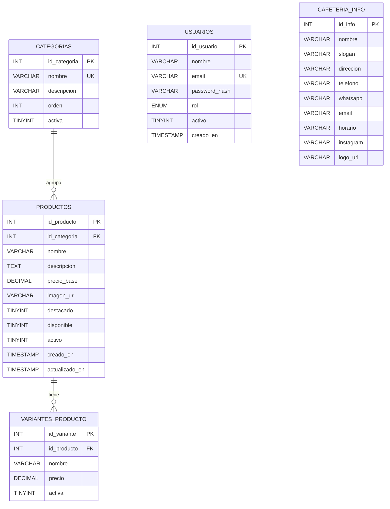

# Modelo Entidad–Relación — PWA Cafetería "Café Aroma"

## Diagrama

## Entidades y atributos

### CATEGORIAS
| Atributo | Tipo | Restricciones | Descripción |
|----------|------|---------------|-------------|
| id_categoria | INT | PK, AUTO_INCREMENT | Identificador |
| nombre | VARCHAR(60) | NOT NULL, UNIQUE | Nombre (Cafés, Postres…) |
| descripcion | VARCHAR(200) | NULL | Descripción corta |
| orden | INT | DEFAULT 0 | Orden de aparición en el menú |
| activa | TINYINT(1) | DEFAULT 1 | Visibilidad |

### PRODUCTOS
| Atributo | Tipo | Restricciones | Descripción |
|----------|------|---------------|-------------|
| id_producto | INT | PK, AUTO_INCREMENT | Identificador |
| id_categoria | INT | FK → CATEGORIAS, NOT NULL | Categoría |
| nombre | VARCHAR(100) | NOT NULL | Nombre del producto |
| descripcion | TEXT | NULL | Descripción / ingredientes |
| precio_base | DECIMAL(10,2) | NOT NULL, ≥ 0 | Precio base en COP |
| imagen_url | VARCHAR(255) | NULL | URL de la imagen |
| destacado | TINYINT(1) | DEFAULT 0 | Aparece en destacados |
| disponible | TINYINT(1) | DEFAULT 1 | 0 = Agotado |
| activo | TINYINT(1) | DEFAULT 1 | 0 = oculto en el menú |
| creado_en / actualizado_en | TIMESTAMP | AUTO | Auditoría |

### VARIANTES_PRODUCTO
| Atributo | Tipo | Restricciones | Descripción |
|----------|------|---------------|-------------|
| id_variante | INT | PK, AUTO_INCREMENT | Identificador |
| id_producto | INT | FK → PRODUCTOS, ON DELETE CASCADE | Producto |
| nombre | VARCHAR(40) | NOT NULL | Pequeño / Mediano / Grande |
| precio | DECIMAL(10,2) | NOT NULL | Precio de la variante |
| activa | TINYINT(1) | DEFAULT 1 | Visibilidad |

### USUARIOS
| Atributo | Tipo | Restricciones | Descripción |
|----------|------|---------------|-------------|
| id_usuario | INT | PK, AUTO_INCREMENT | Identificador |
| nombre | VARCHAR(100) | NOT NULL | Nombre |
| email | VARCHAR(120) | NOT NULL, UNIQUE | Correo de acceso |
| password_hash | VARCHAR(255) | NOT NULL | Hash bcrypt |
| rol | ENUM('admin','editor') | DEFAULT 'admin' | Rol |
| activo | TINYINT(1) | DEFAULT 1 | Estado |
| creado_en | TIMESTAMP | AUTO | Fecha de creación |

### CAFETERIA_INFO
Tabla de un solo registro con los datos generales del negocio (nombre, slogan, dirección, teléfono, WhatsApp, correo, horario, Instagram y logo).

## Relaciones

| Relación | Cardinalidad | Regla |
|----------|--------------|-------|
| CATEGORIAS — PRODUCTOS | 1 : N | Una categoría agrupa muchos productos; cada producto pertenece a una sola categoría. `ON DELETE RESTRICT`. |
| PRODUCTOS — VARIANTES_PRODUCTO | 1 : N | Un producto tiene 0..N variantes; si se elimina el producto se eliminan sus variantes (`CASCADE`). |
| USUARIOS | Independiente | Solo se usa para autenticación del panel de administración. |
| CAFETERIA_INFO | Independiente | Registro único de configuración. |

## Notas de diseño
- Se usa **borrado lógico** (`activo`) en productos para no perder historial y poder reactivarlos.
- Si un producto tiene variantes activas, el menú muestra el precio de cada variante; si no, muestra `precio_base`.
- Si más adelante quieres agregar pedidos, se añadirían las tablas `PEDIDOS` y `DETALLE_PEDIDO` sin modificar este modelo.
